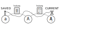
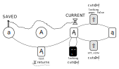

Switching views
=========

Squeekboard layout files are separated into *views*.

What are views?
-------------------

A view is the button arrangement which you see on Squeekboard's panel. The view always spans the entire panel area, so it's not possible to see two views at the same time, even if the layout contains multiple views.

Views are useful because they allow to have many more buttons than would fit on the panel at the same time. That works because views can be switched.

Views are different from layouts: they can be switched without affecting the active language, and without touching the globe button. Layouts cannot share views, so switching layouts *always* switches views.

Switching views
------------------

The model selected for switching views is less similar to "levels" known from physical keyboards, but closer to "rooms", which may resemble a game map.

Buttons don't have states. It's more of a model where each view is a room, and buttons are doors. Switching means moving to the next room, and buttons highlight according to which view/room they lead to or from.

There are two basic kinds of switching buttons: one way (`set_view`), and two way (`locking`). `locking` is the more sophisticated one. When placed inside `lock_view`, it is drawn highlighted, and goes to `unlock view`. When placed inside any other view, it behaves like `set_view`.

 This diagram shows which buttons can switch between two views. Views are shown as circles, and buttons as rounded rectangles.
The two buttons are separate, and visible only in the view *from which the switch starts*. Note that the `locking` button is shown highlighted. That's because it's in `upper` view, which matches its `lock_view`.

Latching
----------

`locking` buttons provide a second mode of operation: latching. It's useful when the target view is needed only for a single button press, like entering a single accent or a single capital letter in Latin scripts.

When a latching button is pressed, the keyboard remembers to come back to the current (source) view, and then the view is switched. If another `locking` button is pressed, the source view stays in memory. If a text button is pressed, the view from memory is shown again, and forgotten.

 In this diagram, the dashed line connects the view the typist is seeing to the view remembered for unlatching.

There are two ways to erase the memory without going back to the remembered view. Pressing the button again will permanently switch to the current view, and `set_view` will permanently switch to its target.

In the room metaphor, it's as if tying a thread inside the room before going through the door to the next one. And another `locking` door while holding the thread. Once the Minotaur is slain (text button pressed), the hero follows the thread back to the starting room.

The typist hero cuts the thread in two circumstances: when staying longer in the current room (press button again), or when moving through a `set_view` door.

 This diagram shows the possible ways to stop latching. One is by pressing a text button, which takes back to the original view. Another is pressing a locking button which appears highlighted (note that it can be any button, what matters is its `lock_view`). Finally, switching to another view using a button that doesn't keep the latch on forgets latching.

The layout author should pay attention that `set_view`'s lack of latching does not come as a surprise to typists.

Differences from keyboard levels
---------------------------------------

Views are **not** like keyboard levels.

On a physical keyboard, the number of buttons can not change when switching levels. In Squeekboard, they can have any arrangement of buttons you could imagine.

When switching levels on a keyboard, for example by pressing Shift, the key press not only affects the meaning of other keys, but also tells the application that it's pressed down. In Squeekboard, pressing buttons to change layouts *does not* do anything but switch the layout. Pressing the switching button especially *does not* tell the application that it was pressed. (This is the reason Shift and AltGr modifiers are not implemented in Squeekboard.)

Why not use the "views" model?
-------------------------------------

Squeekboard's goal is to support as many scripts as possible, and the author of the initial design doesn't know a whole lot. There are two problems with using the levels metaphor:

Firstly, the levels model assumes that there is a "base" and an "active" level. This does not work well with scripts that have different but equivalent modes of writing. An example is the Kana layout with Katakana and Hiragana, which are both "base".
Both systems could have been combined, but the view switching designer doesn't have enough experience with different scripts to do that. Some scripts may have different non-hierarchical ways to switch character groups (Balinese?), which could make combining hierarchy with free-form switching even harder.

Secondly, when dealing with languages with a hierarchy, we end up with extra work to eliminate nonsensical combinations. With "symbols" and "uppercase" levels, what does it mean to have both engaged? Eliminating that means extra work. Either validating layouts, so that it's not possible to engage "uppercase" from "symbols", or duplicating, so that "uppercase+symbols" is the same as just "symbols". With "accents" in the mix, this could become a challenge to design well.
